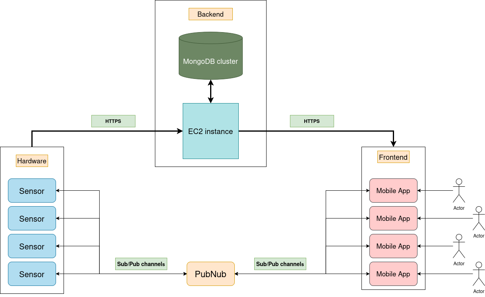
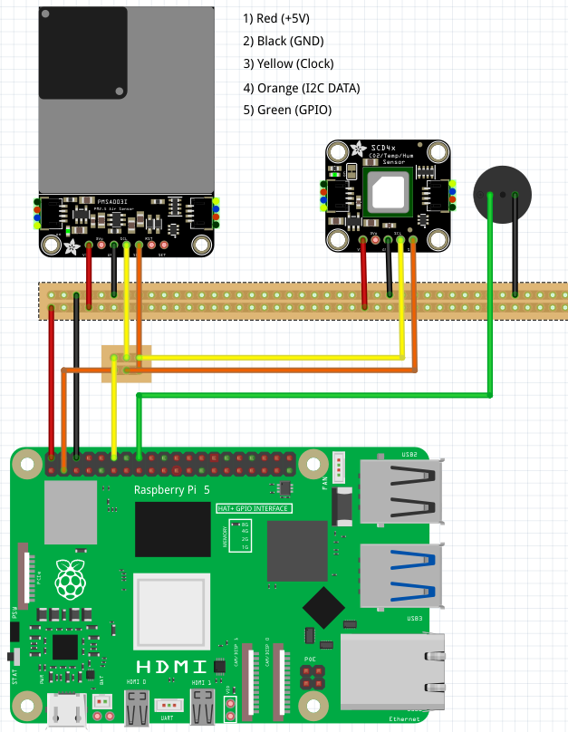

# System Architecture

## System diagram

    

### Data flow

The diagram shows how our system exchanges data between sensors, the backend server, and the frontend application.
We have two different data transfer routes: one for alerts and one for history.

#### **1. Sensor operation and sending alert notifications (via PubNub)**

Each sensor on the device operates according to the following principle:

1. Every 2 seconds the sensor reads a new value (temperature, humidity, CO₂, and dust).
2. The sensor compares the received value with the acceptable limit.
3. If the value is normal, it sends nothing.
4. If the value is above the threshold, the sensor generates an alert.
5. This alert is sent via PubNub to the appropriate channel.

PubNub sends this alert to the mobile app (frontend). The app receives the message and displays a notification to the user that an excess has been detected (for example, high CO₂ levels).
In the diagram, this is the bottom path: sensor → PubNub → app.

#### **2.Sending average values ​​to the Backend (every 10 minutes)**

In addition to alert notifications, the sensor also collects data needed for historical data and analytics.

1. The sensor accumulates all its measurements over 10 minutes.
2. It then calculates average values ​​for each parameter: temperature, humidity, dust, CO₂, etc.
3. The device then transmits this set of average values ​​to the backend via HTTPS.
4. The backend receives the data and verifies that it is correct.
5. If everything is correct, the server stores it in MongoDB.

This part is shown on the top line of the diagram: 
Sensors → HTTPS → Backend → MongoDB.
The saved data is then used to display the history.

#### **3.Receiving data for history**

- When a user wants to view history, the application (frontend) sends a request to the backend via HTTPS.
- The server receives this request, retrieves the stored data from MongoDB, and sends it back in JSON format.
- The frontend receives the data and plots it.

This process is shown in the upper-right arrow of the diagram:
Frontend → HTTPS → Backend → Response with history.

#### **4.Send updated thresholds**

1) When user updates thresholds, the mobile application sends a PubNub message to a sensor
2) The sensor receives message and update saved thresholds
3) Then sensor start using updated thresholds in telemetry calculations and alert logic

## Hardware diagram

    

### Required parts
- Raspberry Pi 5
- Buzzer
- Adafruit particle sensor PMSA003I 
- Adafruit CO2 sensor SCD-41
- Button
